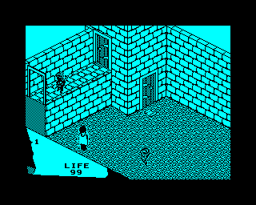
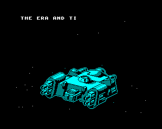
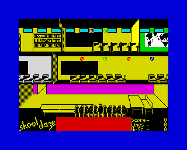
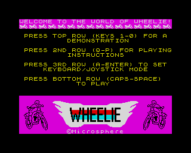

# Warajevo Spectrum Next

A modern **ZX Spectrum 48K / 128K emulator** written in C# on **.NET 10** with
an **Avalonia** cross-platform UI. Warajevo Next is a from-scratch port of the
DOS-era **Warajevo 2.50** originally written by Željko Jurić and Samir Ribić
in Sarajevo (~88,000 lines of Turbo Pascal + x86 assembly).

The port lives in [`warajevo-next/`](warajevo-next/); everything below is a
quick tour. For depth, see the docs in that directory.

## Status

| Layer     | State                                                                      |
|-----------|----------------------------------------------------------------------------|
| Z80 CPU   | Complete. Passes **1335 / 1335** FUSE Z80 conformance cases                |
| Machine   | 48K + 128K memory paging, ULA, keyboard, tape, AY-3-8912 stub              |
| Snapshots | `.SNA` (48K), `.Z80` v1/v2/v3 (48K + 128K)                                 |
| Tape      | `.TAP` pulse-timed playback, plus 0x0556 fast-load trap                    |
| UI        | Avalonia main window: menus, screen bitmap, keyboard, dialogs              |
| Control   | Optional TCP control server (`WARAJEVO_NEXT_CTRL_PORT`, default off) for scripted key injection + screenshot dumps  |
| CI        | Every push scanned; branch protected by a required status check            |

## Tape compatibility (as of 2026-08-05)

Warajevo Next ran the full `test-media/` batch (`.TAP` images) through the
0x0556 fast-load trap, driven end-to-end by the built-in TCP control server
(`KEY SPACE / SNAP <path>` over telnet). 13 of 16 tapes tested reached a
visible title, menu or actual gameplay screen; the three failures cluster
into two known-mechanism buckets, not per-game bugs.

**Reaches gameplay / menu / actual title screen:**

| Title                          | Year  | Fast-load blocks | End state (screenshot)                            |
|--------------------------------|-------|:----------------:|---------------------------------------------------|
| Dizzy 4K Intro                 | 1999  | 4                | Magenta "presents" running                        |
| Rotazoomer 1k Intro            | 2011  | 4                | Title + rotate-zoom effect                        |
| Castor Intro 3: Ocean          | 1998  | 4                | Demo running                                      |
| **Arkanoid** (Imagine)         | 1987  | 6                | Title -> attract -> high scores -> intro scroll   |
| **Fairlight 48K** (The Edge)   | 1985  | 4                | Isometric gameplay, LIFE 99 HUD                   |
| **Wheelie** (Microsphere)      | 1983  | 4                | "WELCOME TO THE WORLD OF WHEELIE!" menu           |
| **Skool Daze** (Microsphere)   | 1985  | 4                | Classroom scrolling, HUD                          |
| **Abu Simbel Profanation**     | 1985  | 4                | KEMPSTON / TECLADO control-select                 |
| Aquaplane (loader)             | 1983  | 4                | Quicksilva "Loading...please wait" title *        |
| AddMortem                      | ~2020 | 4                | Parody MPAA rating title card                     |
| snakescape                     | ~2020 | 4                | "SNAKE ESCAPE" control-select                     |

*Aquaplane needs the multi-load extension - see the "In progress" list below.*

**Loaders on modern-engine games run through the fast-load trap cleanly** -
even for engines Warajevo Next itself does not yet render properly. The
tapes below all completed the 4-block LOAD "" sequence via the ROM trap
and handed control to user code, which then rendered its engine
identifier screen:

| Title            | Year  | Fast-load blocks | End state                                     |
|------------------|-------|:----------------:|-----------------------------------------------|
| DreamWalker 48K  | ~2020 | 4                | "Powered by NIRVANA ENGINE" splash            |
| MultiDude        | 2014  | 4                | "Powered by NIRVANA ENGINE" splash            |

The Nirvana engine's per-row attribute updates are a separate rendering
task on the ULA side; the *tape-loader* path already handles them.

**In progress (documented failure classes, not surprises):**

| Title                    | Symptom                              | Root cause                                                                |
|--------------------------|--------------------------------------|---------------------------------------------------------------------------|
| Sentinel (Firebird)      | "SENTINEL / Searching 00"            | Firebird custom loader polls the EAR bit; `TapeDevice.Tick` isn't yet wired to the Cpu T-state counter, so no pilot / sync / data pulses feed port 0xFE |
| Aquaplane (multi-load)   | Sits at "Loading...please wait"      | Same - multi-load stub calls back into an edge-decoded routine, not ROM   |
| Paperboy (Elite loader)  | Falls back to Sinclair BASIC prompt  | Elite Rapid Loader; needs TZX with `Pure Tone` / `Pulses Sequence` blocks |
| yazziejr, Shock Megademo | Load OK, then black screen           | Per-title trace pending                                                    |

Speedlocked / Alkatraz / Elite-rapid TZX titles (R-Type, Crosswize,
Batman: The Caped Crusader, Cobra, Daley Thompson's Decathlon, ...)
sit in `test-media/tzx/` waiting for the TZX parser (block IDs 0x11 /
0x12 / 0x13 / 0x14) - the raw pulse timings a stock TAP throws away.
That, plus wiring `TapeDevice.Tick` to `Cpu.TStates`, is the next
tape-side milestone.

## Screenshots

See `warajevo-next/docs/screenshots/` for the full 2026-08-05 batch.
A few highlights, all captured via the Avalonia-internal framebuffer
dump (`SNAP <path>` over the TCP control server, exact bytes the
compositor sees, no Win32 middleman):






## Build and run

```bash
cd warajevo-next
dotnet --version   # requires .NET SDK 10.0.302+ (pinned in global.json)
dotnet build
dotnet test
dotnet run --project src/WarajevoNext.App                     # GUI
dotnet run --project src/WarajevoNext.App -- --selftest 500   # headless
```

**ROMs are not bundled.** Supply your own `48.rom` (16 KB) via one of:

1. `$WARAJEVO_NEXT_ROMS` (directory path)
2. `<AppBase>/roms/`
3. `./roms/` relative to the current working directory
4. **File → Load ROM…** in the GUI

## Keyboard mapping

| Host key             | Spectrum key   |
|----------------------|----------------|
| A-Z, 0-9             | same           |
| Enter / Space        | ENTER / SPACE  |
| Left / Right Shift   | CAPS SHIFT     |
| Left / Right Ctrl    | SYMBOL SHIFT   |

## Layout

```text
.
├── warajevo-next/          The .NET 10 + Avalonia port (subject of this repo)
│   ├── WarajevoNext.slnx
│   ├── src/
│   │   ├── WarajevoNext.Cpu/       Z80 core + IMemoryBus / IIoBus
│   │   ├── WarajevoNext.Machine/   memory, ULA, keyboard, tape, AY, snapshots
│   │   └── WarajevoNext.App/       Avalonia GUI + --selftest entry
│   ├── tests/
│   │   ├── WarajevoNext.Cpu.Tests/     FUSE Z80 conformance suite
│   │   └── WarajevoNext.Machine.Tests/ smoke tests
│   ├── README.md, ARCHITECTURE.md, TESTING.md, BUILD_NOTES.md, LICENSE
│   └── global.json, Directory.Build.props, Directory.Packages.props
├── .github/workflows/no-banned-word.yml   Push-time content scan (required)
├── .githooks/pre-push                     Mirror scan run client-side
├── src/, upstream/                        Full archival of DOS Warajevo 2.50 source
├── docs/                                  Historical documentation for the original
├── roms/, tapes/                          Preserved originals kept alongside
└── (see the "About the archived original" section below)
```

## Docs

* [`warajevo-next/README.md`](warajevo-next/README.md) — project-level README
* [`warajevo-next/ARCHITECTURE.md`](warajevo-next/ARCHITECTURE.md) — three-layer design, per-frame data flow, port dispatch
* [`warajevo-next/TESTING.md`](warajevo-next/TESTING.md) — FUSE + Machine + selftest
* [`warajevo-next/BUILD_NOTES.md`](warajevo-next/BUILD_NOTES.md) — SDK pin, NuGet.config, unsafe blocks

## Credits

* **Željko Jurić** and **Samir Ribić** — original Warajevo (Sarajevo, 1997-2001+).
* **Supratim Sanyal** (SANYALnet Labs) — the .NET 10 / Avalonia port.
* FUSE Z80 conformance suite via the `jsspeccy2` mirror.

## Licence

GNU **GPL v3-or-later**, matching the original Warajevo. See
[`warajevo-next/LICENSE`](warajevo-next/LICENSE).

---

## About the archived original

The working root of this repository is [`warajevo-next/`](warajevo-next/) —
that is the subject of the repo. Every other top-level directory
(`src/`, `upstream/`, `docs/`, `roms/`, `tapes/`) is a **complete archival
of the original DOS Warajevo 2.50** (Turbo Pascal + MASM/TASM, four upstream
archives: `Warajevo.zip`, `Specsim.zip`, `Timex.zip`, `Compiler.zip`), kept
in place for historical continuity so the port and its ancestry can be
read side-by-side in a single clone.

The same archival — untouched — is also maintained standalone at the
upstream archive repository:

**<https://github.com/tuklusan/warajevo-spectrum-2.50>**

Refer to the upstream archive (or to the top-level directories here) for
the untouched original source and its historical build instructions
(Turbo Pascal 6.0 or 7.0, MASM for DOS, TASM for DOS).
